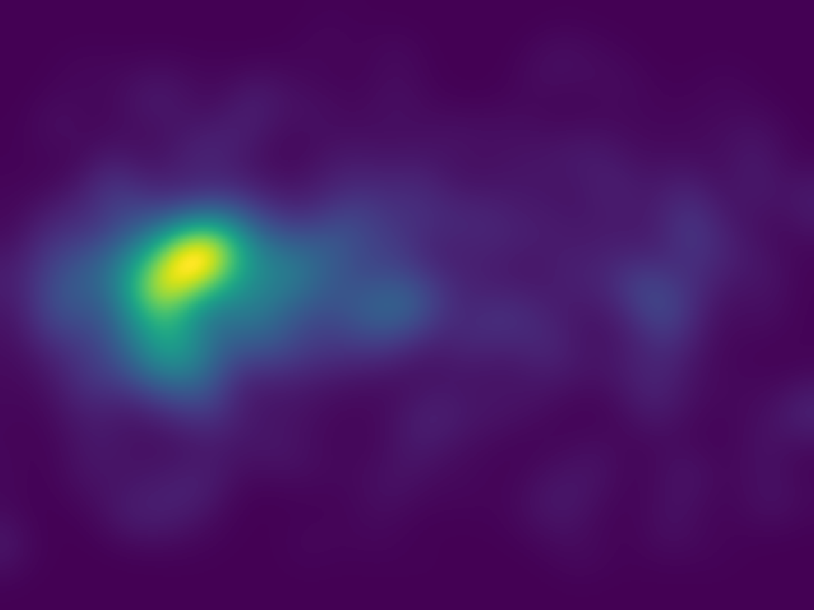
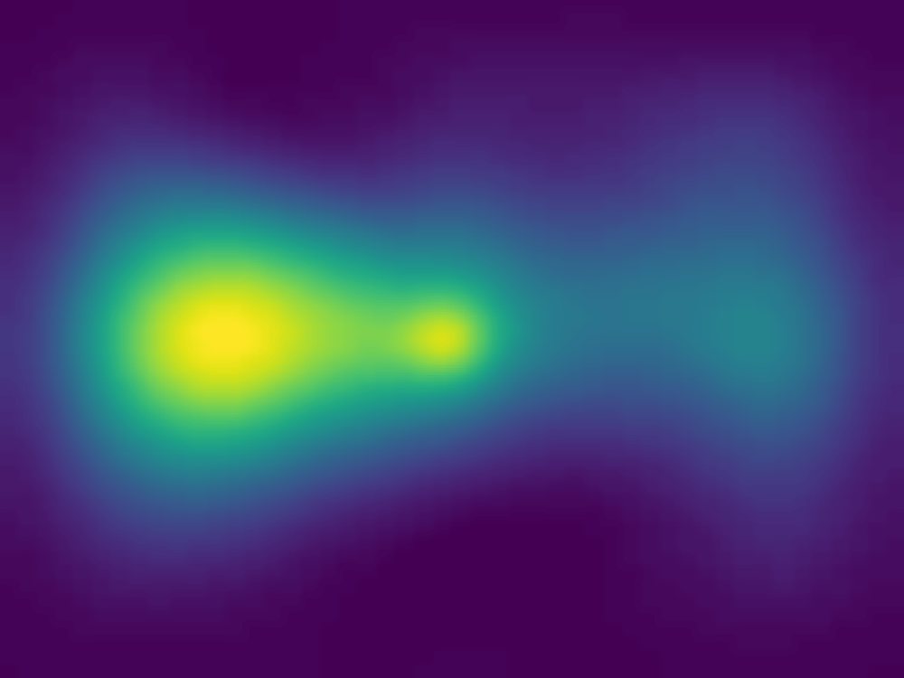
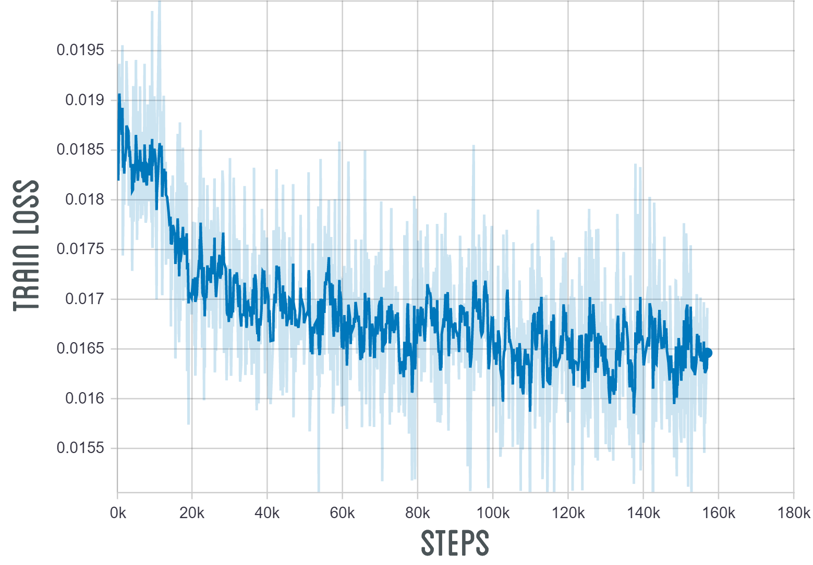
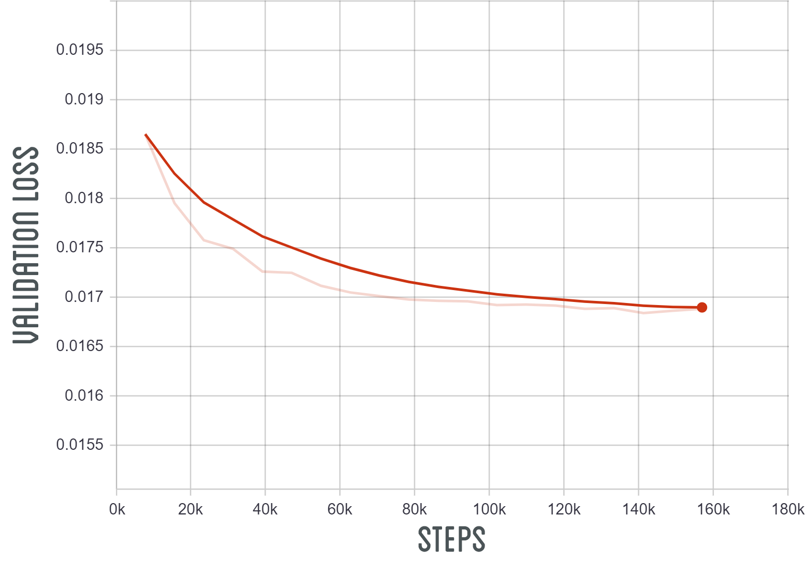

# Convolutional-Neural-Network-Saliency
A convolutional neural network for saliency prediction which represents the probability of visual attention on an image.
Visual attention enables the human vision system to rapidly analyze complex scenes and devote its limited cognitive resources to the most pertinent subsets of sensory data, by acting as a shiftable information processing bottleneck.
The convolutional neural network was trained on the SALICON dataset and consists of three convolutional layers, a fully connected layer, a maxout layer and a final fully connected layer.

|Image|Validation|Prediction|
|-----|----------|----------|
||||

|Training Loss|Validation Loss|
|-------------|---------------|
|||
